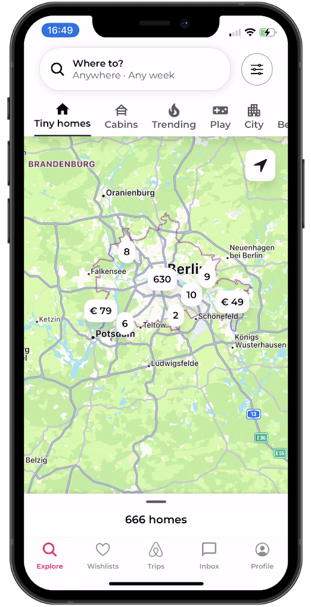

# React Native AirBnB Clone with Clerk

Welcome to the React Native AirBnB Clone with Clerk integration! This project is a fully functional clone of Airbnb's mobile interface, built using React Native and incorporating Clerk for user authentication and management.

### Features

- **User Authentication**: Secure login and signup flows with Clerk.
- **Browse Listings**: Explore a variety of places to stay.
- **Booking System**: Book your stay directly through the app.
- **Search Functionality**: Search for listings by location.
- **User Profiles**: View and edit your profile.

### Technologies Used

- **React Native**: A framework for building native apps using React.
- **Clerk**: A service for handling user authentication and management.
- **Expo**: An open-source platform for making universal native apps for Android, iOS, and the web with JavaScript and React.

### Getting Started

To get this project running on your local machine, follow these steps:

1. **Clone the repository:**
   ```bash
   git clone https://github.com/kashaf12/airbnb.git
   ```
2. **Install dependencies:**
   ```bash
   npm install
   ```
3. **Start the development server:**
   ```bash
   expo start
   ```

### Environment Setup

Make sure to add your Clerk Frontend API key in your environment variables:

## Screenshots

<div style="display: flex; flex-direction: 'row';">





</div>

## Demo


**Author**: Kashaf Ahmed  
**Email**: kashafaahmed@gmail.com
